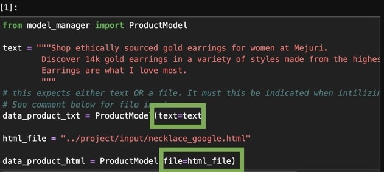
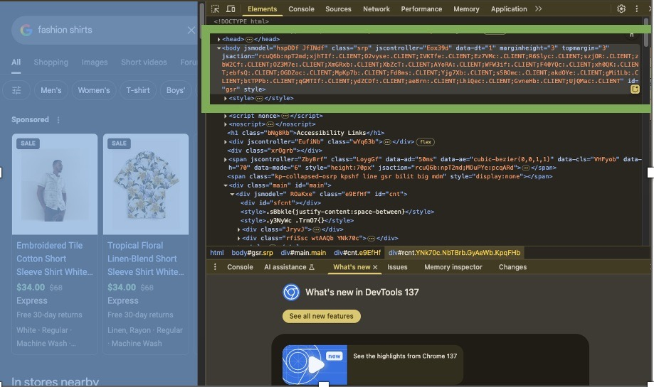
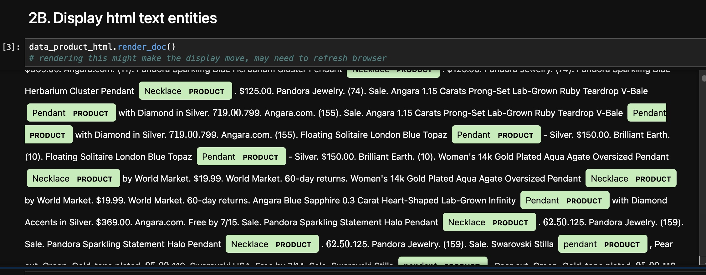
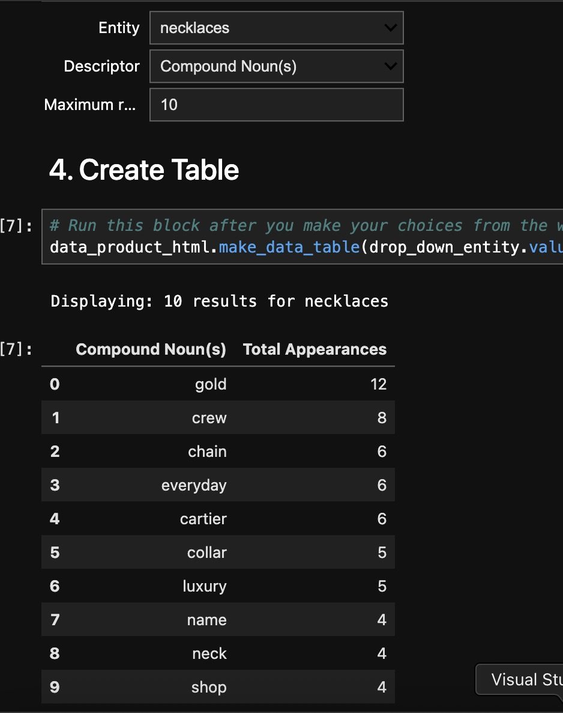
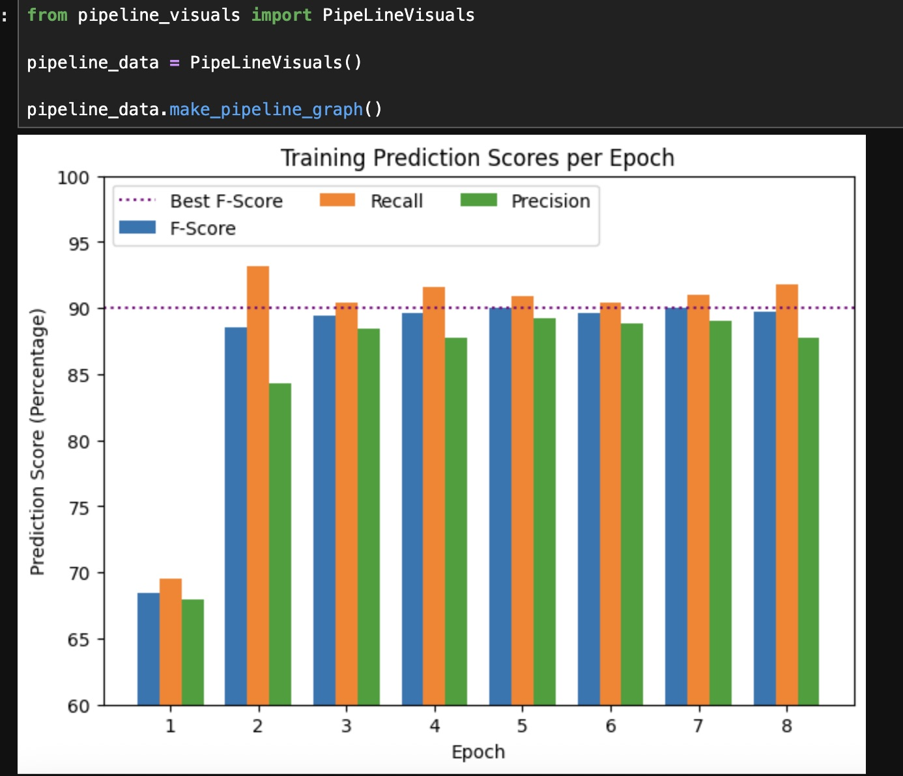
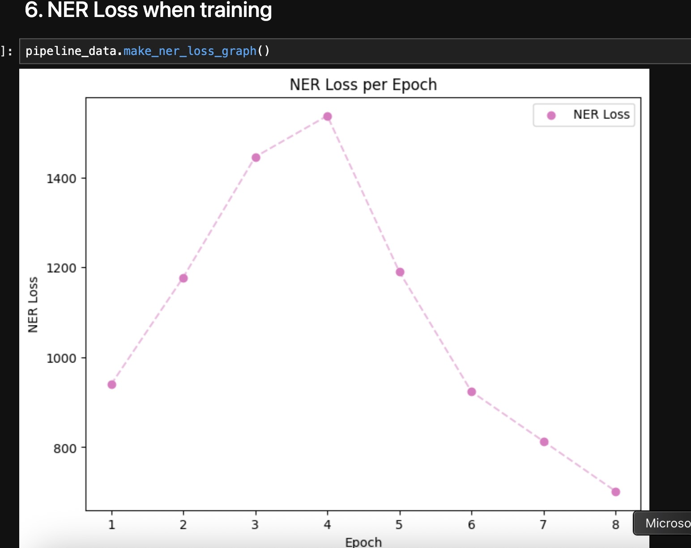

 

    <!--  -->
  </a>

  <h1 align="center">fashioNER</h2>

  

    Named entity recognition (NER) and sentence analyzer.
  

  
Table of Contents :mag: 

  <ol>
    <li>
      <a href="#about-fashioNER">About fashioNER</a>
      <ul>
        <li><a href="#built-with">Built With</a></li>
      </ul>
    </li>
    <li>
      <a href="#getting-started">Getting Started</a>
      <ul>
        <li><a href="#prerequisites">Prerequisites</a></li>
        <li><a href="#setup">Setup</a></li>
      </ul>
    </li>
    <li><a href="#usage">Usage</a></li>
      <ul>
        <li><a href="#input">App Input</a></li>
        <li><a href="#output">App Output</a></li>
        <li><a href="#training">Training</a></li>
      </ul>
      <li><a href="#accuracy">Accuracy</a></li>
  </ol>

## About fashioNER
<!--  -->

fashioNER is a natural language processing (NLP) and computational linguistics exploratory project developed to analyze sentences about fashion-related products. This named entity recognizer (NER) is trained to identify ~100 common product names and creates a data report about the descriptive words that appear nearby. The use case is to analyze listings or information about products from a search engine page. 

 
This NER is trained on Google search data and built from a "blank" spaCy English model. spaCy's pre-trained "en_core_web_lg" model was used to prepare the linguistic analysis.

<a href="#readme-top">:arrow_up: back to top</a>

### Built with

[![Jupyter Notebook][Jupyter Notebook]][jupyter-url]

[![spaCy][spaCy]][spaCy-url]

<a href="#readme-top">:arrow_up: back to top</a>

## Getting Started

### Prerequisites

**Python 3.13.3**

### Setup
<ol>
  <li>
  Please clone this repository onto your local machine
  </li>
  <li>
  Open the terminal and cd into the fashioNER directory.
  </li>
  <li>
  Set Up Virtual Environment
    <ol>
        <li>Create venv: run 
            <code>python -m venv .venv</code>
          </li>
          <li> Activate venv: 
          <ul>
          <li>Mac: 
          <code>source .venv/bin/activate</code>
          </li>
          <li>Windows: 
          <code>.venv\Scripts\activate</code>
          </li>
          </ul>
        </li>
    </ol>
    </li>
      <li>
      Install Requirements
        <ol>
          <li>Upgrade pip: run 
            <code>pip install --upgrade pip</code> 
          </li>
          <li>Install requirements: run 
            <code>pip install -r requirements.txt</code> 
          </li>
          <li>
            Wait for intallation (can take a few minutes).
          </li>
        </ol>
    </li>
  </li>
  <li>
  Run Application in Jupyter Notebook
  <ol>
  <li>
    Open Jupyter notebook: run <code>jupyter notebook</code>
  </li>
  <li>
    The browser should open with the program inside, if it does not, please go to: http://localhost:8888/tree 
  </li>
  <li>
  Click into the <b>/project</b> directory and open the notebook file: <b>Main.ipynb</b>
  </li>
  </ol>
  </li>
</ol>

<a href="#readme-top">:arrow_up: back to top</a>

## Usage

All code for model methods can be found under /project/model_manager.py

### Input: 
The program accepts plain text (not a file) or an HTML file as input; **must** specify the type of input when initializing the ProductModel. For the most informative results, please include a paragraph or more about a fashion product.

#### HTML file input
I recommend using the first page of a product search on Google. This NER was trained specifically on Google queries. 

I recommend saving the body element:
 

### Output:
#### NER visualizer
Block 2A reads text and block 2B reads HTML. These can be adjusted as needed - all code for them can be found in model_manager.py.

Sometimes the UI can go wonky after running. Please refresh the page or scroll back up.

#### Table Analysis Breakdown
Run Box #3 to initialize widgets to customize the analysis. **DO NOT** rerun box #3 unless you want to refresh the values to their defaults.

Select desired widgets and run Box 4 to create a table to view most common words. 

<a href="#readme-top">:arrow_up: back to top</a>

## Train Model
All training code can be found under project/preprocess.py. It takes an HTML file as input. It expects the name of the HTML file to be the product's name followed by a version number ex: "goggles_01.html".

### Annotation
The file project/preprocess.py handles HTML cleaning, adds annotation and divides data into to a dev.spacy and train.spacy file for training. 

Some "tricky" or underrepressented words could miss annotation. Currently it can handle hyphenated words, most pluralizations, and unique English spelling conventions (ex: it label all 3 variants: Scarf, Scarves, and Scarfs as a product entity). 

It can struggle with **pluralia tantum** - words that are <i> always or typically</i> pluralized (ex: pants, scissors). Extra care for appropriate annotation will be needed for this.

### Training
Configuration edits go into base_config.cfg. Visit spacy training documentations for additional information.
<ol>
<li>
To initialize configurations: 
<code>
  python -m spacy init fill-config base_config.cfg config.cfg
</code>
</li>
<li>
Command to train and save output model: 
<code>
  python -m spacy train config.cfg --output ./output --paths.train ./train.spacy --paths.dev ./dev.spacy
</code>
</li>
</ol>

<a href="#readme-top">:arrow_up: back to top</a>

## Accuracy:
This code can be found under /project/pipeline_visuals.py
### Visuals

#### Trainging Prediction Scores per Epoch:

#### NER Loss per Epoch
The initial rising spike happens because the machine had to learn a new label (product) from scratch. It decreases as it gets better at guessing the label. 

<a href="#readme-top">:arrow_up: back to top</a>

<!-- variables -->

[Jupyter Notebook]: https://img.shields.io/badge/Jupyter%20Notebook-F37626?style=flat-square&logo=jupyter&logoColor=white
[jupyter-url]: https://jupyter.org/
[spaCy]: https://img.shields.io/badge/NLP%20with-SpaCy-blue
[spaCy-url]: https://spacy.io/